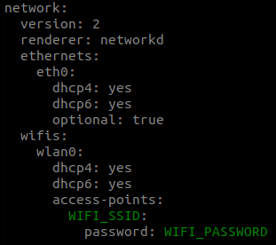
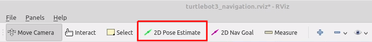

# Hack My Robot
###### System Instructions 

### Robot Preparation
1. Build your robot.
   a. [Robotis eManual](https://emanual.robotis.com/docs/en/platform/turtlebot3/hardware_setup/#hardware-assembly)
   b. [Youtube tutorial](https://www.youtube.com/watch?v=5D9S_tcenL4) 
2. Setup your PC.
   a. [Robotis eManual](https://emanual.robotis.com/docs/en/platform/turtlebot3/sbc_setup/#sbc-setup)
   b. Download and install Ubuntu on your PC (Remote PC). The recommended distribution is Noetic. You're free to install everything on a virtual machine, but performance wise it's going to be better if you partition your disk. 
   c. Install dependent ROS packages and TurtleBot3 packages.
3. Setup TurtleBot SBC.
   a. Either follow [Robotis eManual](https://emanual.robotis.com/docs/en/platform/turtlebot3/sbc_setup/#sbc-setup) to flash their ROS image and set up the TurtleBot.
   b. Or flash the micro SD card with the provided [.img file]() from the HMR organisers. This image is built based on the one provided by Robotis in their tutorial, and you can achieve the same results by following the full tutorial.
   c. Configure the WiFi Network Settings
    -  Open a terminal window and go to the ```/etc/netplan``` directory in the microSD card.
    - Edit the 50-cloud-init.yaml file to modify your WIFI_SSID and your WIFI_PASSWORD. 
    ```
    sudo nano 50-cloud-init.yaml
    ```
    
4. ROS Network configuration.
   a. Adjust the parameters according to the IP addresses of your devices.
   b. Remote PC.
    - ROS_MASTER_URI=http://localhost:11311
    - ROS_IP={IP_ADDRESS_OF_REMOTE_PC}
    - Include the IP address and hostname of the TurtleBot3 in your /etc/hosts file (if you don't do this, you might have issues communicating with the TurtleBot3 later on).
  
   c. TurtleBot3 SBC. 
    - ROS_MASTER_URI=http://{IP_ADDRESS_OF_REMOTE_PC}:11311
    - ROS_IP={IP_ADDRESS_OF_TURTLEBOT3}
    - Include the IP address and hostname of your Remote PC in the TurtleBot3 /etc/hosts file (if you don't do this, you might have issues communicating with the TurtleBot3 later on).
  
5. Test your configuration.
   a. Bringup your robot by following the [Robotis eManual](https://emanual.robotis.com/docs/en/platform/turtlebot3/bringup/#bringup).
   b. Test the [keyboard teleoperation](https://emanual.robotis.com/docs/en/platform/turtlebot3/basic_operation/) from your Remote PC to check if all the network configuration parameters have been properly set. If the robot is not moving, you probably need to recheck all the network parameters.  

### Mapping the scenario
For further detailed information please refer to the [Robotis eManual](https://emanual.robotis.com/docs/en/platform/turtlebot3/slam/#run-slam-node).

1. ```roscore``` on Remote PC.
2. Bringup of the robot on the TurtleBot3 if not running already. 
```
roslaunch turtlebot3_bringup turtlebot3_robot.launch
```
3. Bringup of the RPi camera node. 
```
roslaunch turtlebot3_bringup turtlebot3_rpicamera.launch
```
4. Use the SLAM algorithm to map the scenario. It doesn't need to be too big, just focus on the area you are going to work with, around 1.5mx1.5m. 
```
roslaunch turtlebot3_slam turtlebot3_slam.launch
```
5. Use the keyboard teleoperation to drive your robot around, until you are satisfied with the mapped environment.
```
roslaunch turtlebot3_teleop turtlebot3_teleop_key.launch
```
6. Save your map. You can use the *-f* option in order to specify a folder location and a file name. 
```
rosrun map_server map_saver -f ~/map
```
7. Kill the SLAM node.

### Launch the Hack My Robot routine

The launch file located in ```hack_my_robot/launch/hack_my_robot_complete.launch``` already launches the navigation node, the image_saver node and the hack_my_robot main routine node. Refer to the [Robotis eManual](https://emanual.robotis.com/docs/en/platform/turtlebot3/navigation/#run-navigation-nodes) for further information regarding the navigation stack. 

1. Edit the launch file to suit your parameters.
   a. Map name and location for the navigation node.
   b. Any other parameter you might have modified (although we don't recommend that).  
2. Launch the file. 
```
roslaunch hack_my_robot hack_my_robot_complete.launch
```
3. Setup your initial position.

4. Launch the keyboard teleoperation node in order to move your robot around so it can locate iself on the map (just spinning around should be enough).
5. Once the robot has located itself, we need to change the functionality of the 2D Pose Estimate button. We will use the same tool in order to provide our robot the 3 waypoints needed for the Hack My Robot main routine. 
   a. Go to the Panels view and make the "Tools Properties" panel active.
   b. Change the topic of the 2D Pose Estimate tool from */initialpose* to */addpose*
   c. Close the panel. 
6. Indicate 3 positions in the map using the 2D Pose Estimate tool, in the same way as you indicated the initial position of the robot in Step 3. A small green arrow should appear where you indicated the position, and a message should appear on the terminal where you launched the ```hack_my_robot_complete.launch file```. 
7. Publish an empty message to the path_ready topic to run the routine once and save the positions in a file. 
```
rostopic pub -1 /path_ready std_msgs/Empty
```
8. Wait until it finishes the routine. If all went well, the robot should have taken 3 pictures in the 3 locations you previously set. 
9.  If you are happy with the routine, publish an empty message to the start_journey topic to start a loop. The routine will stop as soon as you stop publishing the message to the topic. 
```
rostopic pub /start_journey std_msgs/Empty
```
10.  Let's get hacking!!